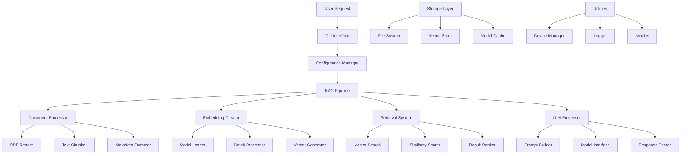

# 🏗️ Architecture Documentation
## Modular RAG Pipeline v2.0

### System Architecture Overview

The Modular RAG Pipeline follows a clean, layered architecture that separates concerns and ensures maximum maintainability and extensibility.

```
┌─────────────────────────────────────────────────────────────────┐
│                        🎯 Application Layer                     │
├─────────────────────────────────────────────────────────────────┤
│  Main Entry Point  │  CLI Parser  │  Configuration Manager     │
└─────────────────────────────────────────────────────────────────┘
                                   │
┌─────────────────────────────────────────────────────────────────┐
│                       🖥️ Interface Layer                        │
├─────────────────────────────────────────────────────────────────┤
│  Interactive Mode  │  Batch Mode  │  API Mode  │  Web Interface │
└─────────────────────────────────────────────────────────────────┘
                                   │
┌─────────────────────────────────────────────────────────────────┐
│                      🏗️ Core Pipeline Layer                     │
├─────────────────────────────────────────────────────────────────┤
│              RAG Pipeline Orchestrator                         │
│  • Workflow Management    • Error Handling                     │
│  • State Management       • Progress Tracking                  │
└─────────────────────────────────────────────────────────────────┘
                                   │
┌─────────────────────────────────────────────────────────────────┐
│                      🔧 Processing Layer                        │
├─────────────────────────────────────────────────────────────────┤
│ Document │ Embedding │ Retrieval │ LLM        │ Vector         │
│Processor │ Creator   │ System    │ Processor  │ Store          │
└─────────────────────────────────────────────────────────────────┘
                                   │
┌─────────────────────────────────────────────────────────────────┐
│                       🛠️ Utility Layer                          │
├─────────────────────────────────────────────────────────────────┤
│Device Mgmt│ Logger   │Text Utils │Config Mgmt │ Metrics        │
└─────────────────────────────────────────────────────────────────┘
                                   │
┌─────────────────────────────────────────────────────────────────┐
│                      🗄️ Storage Layer                           │
├─────────────────────────────────────────────────────────────────┤
│ File System │ CSV Store │ Vector DB │ Model Cache │ Temp Storage │
└─────────────────────────────────────────────────────────────────┘
```

### Component Interactions



### Design Patterns

#### 1. **Strategy Pattern**
- Multiple embedding models (MPNet, MiniLM, BERT)
- Different LLM implementations (DialoGPT, Gemma, GPT)
- Various retrieval strategies (semantic, hybrid, keyword)

#### 2. **Factory Pattern**
- Model factory for creating different AI models
- Processor factory for different document types
- Interface factory for different user modes

#### 3. **Observer Pattern**
- Progress tracking and updates
- Error notification system
- Performance monitoring

#### 4. **Dependency Injection**
- Configuration injection
- Model injection
- Service injection

### Data Flow Architecture

```
[PDF Document] 
    ↓ [Document Processor]
[Text Chunks + Metadata]
    ↓ [Embedding Creator]
[Vector Embeddings]
    ↓ [Storage]
[Persisted Embeddings]
    ↓ [Retrieval System]
[Query] → [Vector Search] → [Relevant Chunks]
    ↓ [LLM Processor]
[Contextualized Response]
    ↓ [Interface Layer]
[User Output]
```

### Error Handling Strategy

```python
class ErrorHandler:
    """Centralized error handling with graceful degradation"""
    
    def handle_document_error(self, error):
        # Fallback to alternative processing
        pass
    
    def handle_model_error(self, error):
        # Switch to CPU if GPU fails
        # Use smaller model if memory insufficient
        pass
    
    def handle_retrieval_error(self, error):
        # Fallback to keyword search
        # Reduce retrieval count
        pass
```

### Performance Optimization

#### Memory Management
- **Lazy Loading**: Models loaded only when needed
- **Memory Pools**: Reuse allocated memory
- **Garbage Collection**: Explicit cleanup of large objects
- **Streaming**: Process large documents in chunks

#### GPU Optimization
- **Batch Processing**: Maximize GPU utilization
- **Memory Monitoring**: Prevent OOM errors
- **Model Quantization**: Reduce memory footprint
- **Device Allocation**: Smart GPU/CPU task distribution

#### Caching Strategy
```python
@lru_cache(maxsize=1000)
def get_embedding(text_chunk: str) -> np.ndarray:
    """Cache frequently accessed embeddings"""
    pass

@disk_cache(expire_after=3600)
def process_document(pdf_path: str) -> List[Dict]:
    """Cache processed document chunks"""
    pass
```

### Scalability Considerations

#### Horizontal Scaling
- **Microservices**: Split into independent services
- **Queue System**: Async processing with Celery/RQ
- **Load Balancing**: Distribute requests across instances
- **Container Orchestration**: Kubernetes deployment

#### Vertical Scaling
- **Multi-GPU Support**: Distribute models across GPUs
- **Memory Scaling**: Handle larger documents
- **CPU Scaling**: Parallel processing for CPU tasks
- **Storage Scaling**: Efficient vector storage

### Security Architecture

#### Data Protection
- **Local Processing**: No data leaves your environment
- **Encryption**: At-rest and in-transit encryption
- **Access Control**: Role-based permissions
- **Audit Logging**: Complete operation tracking

#### Model Security
- **Model Validation**: Verify model integrity
- **Sandboxing**: Isolated model execution
- **Resource Limits**: Prevent resource exhaustion
- **Update Verification**: Secure model updates

### Monitoring & Observability

#### Metrics Collection
```python
class MetricsCollector:
    def track_processing_time(self, stage: str, duration: float):
        pass
    
    def track_memory_usage(self, component: str, usage: int):
        pass
    
    def track_accuracy(self, metric: str, score: float):
        pass
    
    def track_errors(self, error_type: str, count: int):
        pass
```

#### Health Checks
- **Component Health**: Monitor each module
- **Resource Health**: Track CPU/GPU/Memory
- **Model Health**: Validate model responses
- **System Health**: Overall system status

### Extension Points

#### Adding New Document Types
```python
class CustomDocumentProcessor(DocumentProcessor):
    def read_custom_format(self, file_path: str) -> List[Dict]:
        """Implement custom document processing"""
        pass
```

#### Adding New Models
```python
class CustomEmbeddingModel(EmbeddingCreator):
    def create_custom_embeddings(self, texts: List[str]) -> np.ndarray:
        """Implement custom embedding logic"""
        pass
```

#### Adding New Interfaces
```python
class WebInterface(Interface):
    def start_web_server(self, port: int):
        """Implement web-based interface"""
        pass
```

This architecture ensures the system is:
- ✅ **Maintainable**: Clear separation of concerns
- ✅ **Scalable**: Horizontal and vertical scaling support
- ✅ **Testable**: Each component can be tested independently
- ✅ **Extensible**: Easy to add new features
- ✅ **Observable**: Complete monitoring and logging
- ✅ **Secure**: Multiple layers of security
